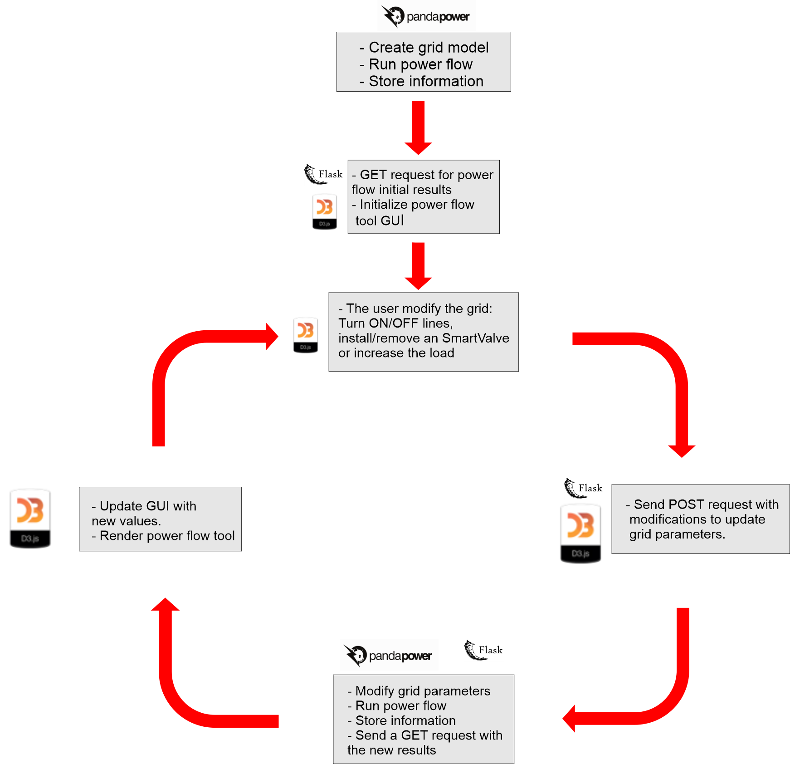

# Power Flow Tool - Documentation
Power Flow Tool V1.0
Developed for Smart Wires, Inc. by Annie Fu and Carlos Toledo
December 2020 - February 2021.
​
## OVERVIEW
​
The Power Flow Tool is a dynamic power flow visualization tool built in HTML, CSS, and the D3.js library in JavaScript in the front-end and Python in the back-end. Back-end processing is done with the package Pandapower. Flask is used to facilitate communication between the front-end and back-end. 
​
The purpose of the tool is to demonstrate how installing SmartValve technology into a grid can moderate line overloads and optimize grid efficiency. Users can freely install SmartValves onto lines, adjust their voltage, mode, and quantity, and turn lines on/off.
​
The repository for this project can be found at https://gitlab.com/smartwires/general/power-flow-tool. 
​
## SYSTEM COMPONENTS --- Add Photos
​
                
+ Topojson Map
    + The Map background is generated through a topojson file, rendered through D3.js and stored in variable **map_background_svg**.
+ Power Grid Elements
    + Canvas for all the grid elements, including buses, lines, generators, loads, and their associated components. Stored in variable **grid_elements**.
+ System Overview Menu
    * The System Overview displays calculated parameters of Additional Load Enabled, MW Pulled, MW Pushed, # Deployments, SmartValve Capacity, and Total Voltage Injected. These parameters are calculated in app.py in Python, then returned through json data stored in variable SVResults.
    * The System Overview menu is stored in variable **system_overview**.
+ Three-part Action Menu
    * The Three-part Action Menu opens when a user clicks on a line, showing three options:
       * View Line Overview Menu
       * Turn Line On/Off
       * Install SmartValve
    * The three-part action menu is stored in variable **three_menu**.
+ Line Overview Menu
    * The Line Overview Menu displays parameters returned by Pandapower and calculated in Python, including Power, Current, Resistance, Reactance, Length, Maximum Current, and MVar per phase. These parameters are calculated in app.py, then returned through json data stored in variable LineResults. 
    * The Line Overview is stored in a variable **tooltip**.
+ SmartValve Controls Menu
    * The SmartValve Controls Menu allows the user to edit details of SmartValve deployments, including voltage injection, push/pull mode, and quantity. Sub-components include a sliding toggle for push/pull, a slider for voltage injection, and buttons for changing quantity.
    * The SmartValve Controls Menu is stored in variable **sv_controls**.
​
Est. Duration: ~120hrs
​
## How to Set Up the Power Flow Tool on your own Computer
​
To set up the Power Flow Tool on your computer you need to install Visual Studio Code and Anaconda 
 1. Download or copy the folder power-flow-tool on your local computer.
 2. To run the code, the following libraries are needed:  [Pandas](https://pandas.pydata.org/docs/user_guide/index.html) , [Pandapower](https://pandapower.readthedocs.io/en/v2.4.0/), [Numpy](https://numpy.org/doc/stable/reference/), [Flask](https://flask.palletsprojects.com/en/1.1.x/) and [matplotlib](https://matplotlib.org/3.3.3/contents.html), which can install using the command Prompt:
    a. Download or copy the folder power-flow-tool on your local computer.
    b. To install the libraries run:
    ```sh
    pip install pandas
    pip install pandapower
    pip install Numpy
    pip install Flask
    ```
 3. To run the power flow tool, go to Visual Studio Code,  open folder _power-flow-tool_ and the file **app.py**. Click on Run on the left side of the menu, and then on the Run and Debug option. A menu will appear, select Flask as the debug configuration.
​
4.  In the Visual Studio Code console, the server where the power flow tool is running will appear, which by default is http://127.0.0.1:5000/. Open the web browser and go to the address to start using the power flow tool.
​
​
## Power Flow Tool architecture
​
The Power flow tool is based on a communication procedure cycle between two programming languages Python and Javascript where both read, write and exchange data,  as is illustrated in the next figure which represents the main blocks for the platform implementation.

 

It starts with creating and defining the system elements (generators, lines and loads) with their parameters and then a power flow is executed. The system elements and results of this power flow solution are stored in Json format variables. When the user opens the navigator, a GET request is sent to get the system information and power flow results to be used for initializing the power flow tool GUI. Follow it, modification in the system can be made by the user, those actions activate a POST request to pandapower which modify the system parameters to re-run the power flow simulation and send the information again to the frontend where it is updated in the power flow tool GUI. This cycle repeats with the modifications made by the user.
​
The principal libraries employed for developing the power flow tool are:
+ Pandapower: Is an open-source tool for power system modeling, analysis, and optimization with a high degree of automation.
+ Flask: Flask is a web framework, it's a Python module for developing web applications easily which allow to exchange information from the backend to the frontend and vice versa.
+ D3.js: is a JavaScript library for producing dynamic, interactive data visualizations in web browsers.